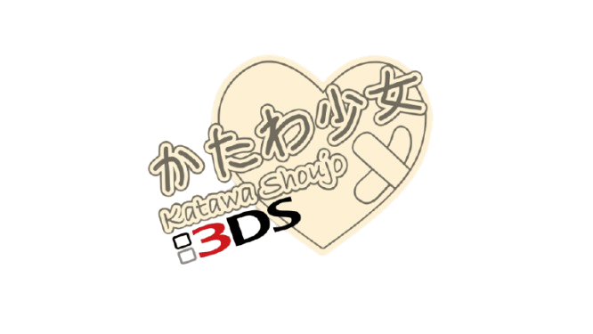

  

# Katawa Shoujo - 3DS Port

---

## 📜 Description

> An unofficial port of the visual novel **Katawa Shoujo**, adapted for the 3DS console.

The project started around November 2024, after I played the game again after many years. So I decided to make this port for one of my favorite consoles... the 3DS.

I started it with LUA POTION... but it didn't work out. Then I moved on to pure C++, but nothing. Finally, I developed it in Unity, and I've managed to make good progress, so here we are n.n

That's the reason for this project, which is, more than anything, a personal one.

If you'd like to make your own version, go for it n.n

### Based on the Original Work

This project is a tribute and would not be possible without the incredible work of **Four Leaf Studios**. 

Visit the [**official Katawa Shoujo website**](https://www.katawa-shoujo.com/) to download the original game and learn more about its creators.

---

## 📊 Project Status

> ⚠️ **Attention:** This project is in a **DEMO** state.

*   **Playable Content:** The current demo covers the story from the beginning up to part of Act 1, before entering the nurse's office for the first time.
*   **Supported Languages:** Spanish, English. (more to come in the future)

---

## 💾 Installation and File Formats

In the RELEASES section, you will find two types of files:

### `.cia`
This format is for installing the game directly to the HOME Menu of a console with custom firmware.

1.  Copy the `.cia` file to your console's SD card.
2.  Insert the SD card into your 3DS and turn it on.
3.  Open the **FBI** application.
4.  Navigate to the `.cia` file's location, select it, and choose the "Install and delete CIA" option.
5.  The game will appear as a gift-wrapped icon on your HOME Menu!

### `.cci`
This is the file generated by the Unity build. If you know how, you can convert the .cci to .cia yourself. This is in case the provided .cia doesn't work for you, though there shouldn't be any issues (I hope).

1.  Copy the `.cci` file to your console's SD card.
2.  Access GodMode9.
3.  Navigate to the file's location and convert it to `.cia`.
4.  Wait for the conversion process to finish.
5.  Install the `.cia` as you would any other, and you're all set.

---

## ⚠️ Warning

*   **Unofficial Port:** This is a non-profit, fan-made project. It is not affiliated with, authorized, or endorsed by Four Leaf Studios or any other group or company.
*   **Original Content:** Katawa Shoujo contains themes of disability and deals with some mature subject matter, including sexuality and adult situations. Player discretion is advised.

---

## 🐞 Known Bugs (Demo)

*   No known bugs... for now.

If you find any bugs, please send me a DM on Reddit "u/Cratobeta_18" or post in the project's subreddit [**r/KatawaShoujo3DSPort**](https://www.reddit.com/r/KatawaShoujo3DSPort) so I can take note of it n.n

---

## 👥 Credits

### Original Work
*   **Four Leaf Studios:** Creators of the story, characters, art, and music of Katawa Shoujo. All credit for this incredible work belongs to them.

### Nintendo 3DS Port
*   **Patrick Vega / Cratobeta:** (Me) Programmer... and all that stuff XD

### Special Thanks
*   [**Katawa Shoujo: Re-Engineered:**](https://www.fhs.sh/projects/ksre) For giving me permission to use their assets like images, effects, etc. Visit the official page to learn more.
*   [**The katawashoujo subreddit**](https://www.reddit.com/r/katawashoujo) For being the space where I gained outreach and was able to share this project n.n 

---

  Thanks for playing!

